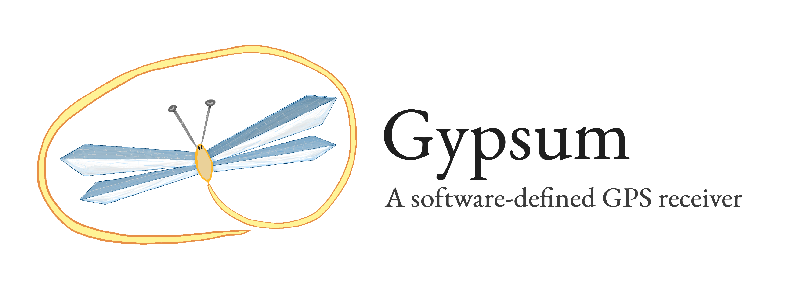
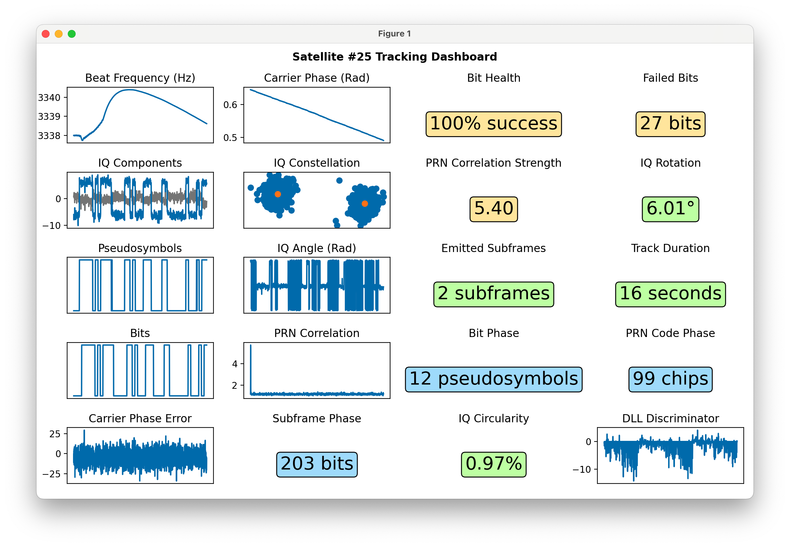

  

gypsum is a homebrew GPS receiver, written in Python. gypsum can carry out a position fix in less than 1 minute of antenna readings from cold start. 

gypsum implements a GPS signal processing stack with no dependencies aside from `numpy`. 

  

gypsum turns any commodity SDR into a GPS receiver. I primarily use an [RTL-SDR](https://www.rtl-sdr.com/buy-rtl-sdr-dvb-t-dongles/), and have had success with a [HackRF](https://greatscottgadgets.com/hackrf/one/) as well. Either of these can be paired with any patch antenna sensitive to 1.57542MHz.

[This project comes with a 4-part writeup](https://axleos.com/building-a-gps-receiver-part-1-hearing-whispers/) on implementing a GPS receiver from scratch.

## Video

## Setup

## Running

## License

MIT 